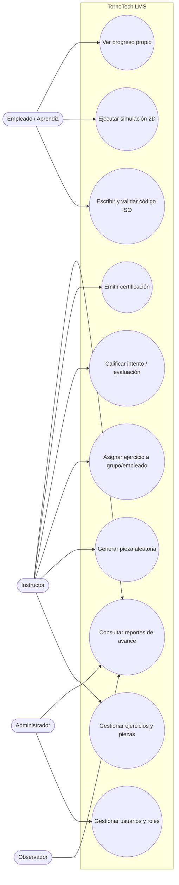
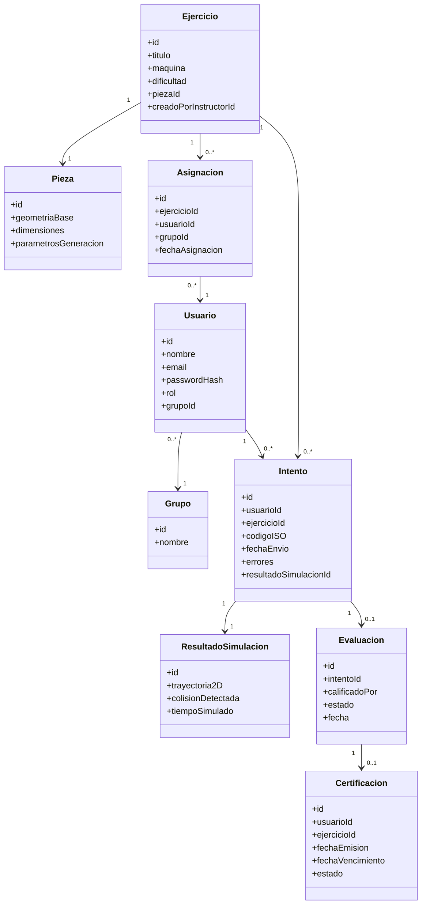
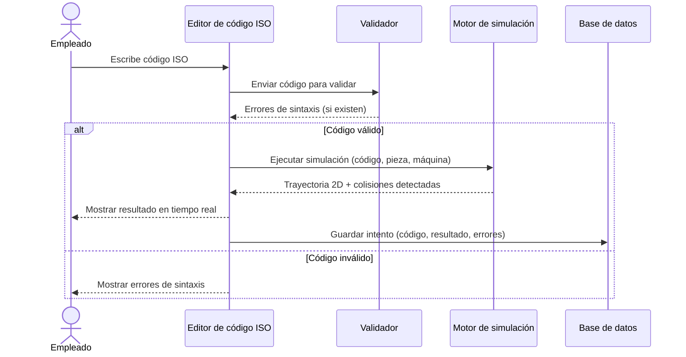
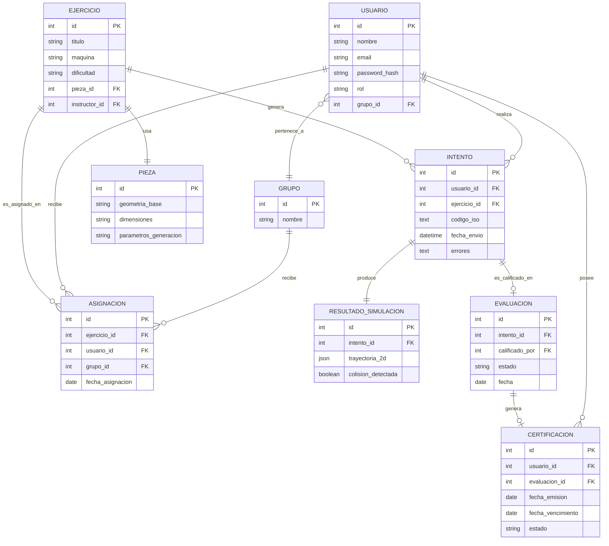
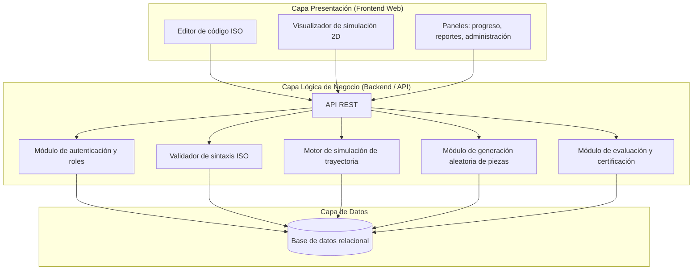

# Documentación Previa de Desarrollo
## TornoTech LMS — Simulador de Mecanizado CNC (Torno y Fresadora)

---

## 1. Introducción y contexto

TornoTech necesita un sistema de capacitación interno para su personal técnico de manufactura. Actualmente la capacitación en programación de máquinas CNC (torno y fresadora) es dispersa, no existe un control centralizado de qué empleado ha completado qué entrenamiento, y el proceso de inducción de personal nuevo es lento. Además, no hay una forma controlada de generar ejercicios de práctica de programación ISO sin usar maquinaria real, lo que implica riesgo, costo de material y tiempo de máquina detenida.

### 1.1 Objetivo general

Desarrollar una aplicación web (LMS) que permita capacitar a empleados en la programación de código ISO (G/M) para control de tornos y fresadoras CNC, mediante un editor de código, un simulador visual de trayectoria de corte y un sistema de seguimiento de progreso y certificación.

### 1.2 Objetivos específicos

- Centralizar la gestión de capacitaciones y su seguimiento por empleado.
- Permitir practicar programación ISO sin usar máquina física, mediante simulación 2D.
- Detectar errores de programación (sintaxis y colisiones/trayectorias inválidas) antes de que el empleado opere una máquina real.
- Dar a instructores control manual sobre qué ejercicios asignar a cada grupo o empleado según su nivel.
- Registrar evaluaciones y certificaciones con fecha de vencimiento, con reportes visibles para supervisores.
- Reducir el tiempo de onboarding de personal nuevo en el área de mecanizado CNC.

---

## 2. Alcance del proyecto

### 2.1 Incluido en esta primera versión

- Simulación **2D** de trayectoria de corte para **torno CNC** y **fresadora CNC**, con dialecto **ISO estándar** (tipo Fanuc), sin variantes por fabricante.
- Editor de código ISO con validación de sintaxis y detección de errores/colisiones.
- Generador aleatorio de piezas de práctica.
- Asignación **manual** de ejercicios por parte del instructor (sin ajuste algorítmico automático de dificultad en esta versión).
- Gestión de usuarios con 4 roles: Administrador, Instructor, Empleado/Aprendiz, Observador.
- Seguimiento de progreso, evaluaciones y certificaciones (incluyendo vencimiento).
- Reportes de avance para instructores/observadores.
- Aplicación **web**, para hasta ~50 usuarios.

### 2.2 Fuera de alcance (versión futura)

- Visualización 3D del mecanizado.
- Ajuste automático/algorítmico de dificultad según desempeño.
- Soporte multi-fabricante de controles CNC (Siemens, Heidenhain, etc.).
- Aplicación de escritorio / uso sin conexión a internet.
- Integración con máquinas CNC reales (solo simulación).

---

## 3. Usuarios y roles del sistema

| Rol | Descripción | Permisos principales |
|---|---|---|
| **Administrador** | Gestiona la plataforma en general | Crear/editar/eliminar usuarios, asignar roles, configurar el sistema, acceso total a reportes |
| **Instructor / Capacitador** | Crea contenido y evalúa aprendices | Crear y modificar ejercicios y piezas, asignar ejercicios a empleados o grupos, revisar intentos, calificar evaluaciones, emitir certificaciones |
| **Empleado / Aprendiz** | Usuario final que se capacita | Ver ejercicios asignados, usar el editor/simulador, enviar intentos, ver su propio progreso y certificaciones |
| **Observador** | Supervisor de planta u otro interesado | Consultar reportes y avance de su equipo, sin permisos de edición |

---

## 4. Requisitos funcionales (RF)

### 4.1 Gestión de usuarios y roles
- **RF-01**: El sistema debe permitir al Administrador crear, editar, desactivar y eliminar cuentas de usuario.
- **RF-02**: El sistema debe permitir asignar uno de los cuatro roles a cada usuario.
- **RF-03**: El sistema debe permitir agrupar empleados por grupo/equipo de capacitación.

### 4.2 Gestión de ejercicios y piezas de práctica
- **RF-04**: El Instructor debe poder crear, editar y eliminar ejercicios (definiendo pieza, máquina asociada y nivel de dificultad).
- **RF-05**: El sistema debe permitir un **generador aleatorio de piezas de práctica**, parametrizable por el instructor (dimensiones, geometría base, máquina).
- **RF-06**: El Instructor debe poder asignar ejercicios de forma **manual** a un empleado o a un grupo.

### 4.3 Editor y validador de código ISO
- **RF-07**: El sistema debe proveer un editor de texto para escribir código ISO (G/M) para torno o fresadora CNC.
- **RF-08**: El sistema debe validar la sintaxis del código ISO ingresado antes de ejecutarlo.
- **RF-09**: El sistema debe detectar y señalar errores de programación: sintaxis inválida, códigos no reconocidos, y trayectorias/colisiones inválidas respecto a la pieza definida.

### 4.4 Simulación de trayectoria de corte
- **RF-10**: El sistema debe generar una visualización **2D** de la trayectoria de corte resultante del código ISO ingresado, sobre la pieza asignada.
- **RF-11**: La simulación debe reflejar el resultado en **tiempo real / feedback inmediato** conforme el usuario ejecuta o modifica el código.
- **RF-12**: El sistema debe distinguir simulación para **torno CNC** y para **fresadora CNC**, respetando ejes y lógica de mecanizado de cada máquina.

### 4.5 Seguimiento, evaluación y certificación
- **RF-13**: El sistema debe registrar cada intento de un empleado (código enviado, resultado, errores, fecha).
- **RF-14**: El sistema debe permitir al Instructor calificar un ejercicio o evaluación como aprobado/reprobado.
- **RF-15**: El sistema debe emitir y almacenar certificaciones con fecha de emisión y fecha de vencimiento.
- **RF-16**: El sistema debe notificar (en plataforma) cuando una certificación esté por vencer o haya vencido.

### 4.6 Reportes
- **RF-17**: El sistema debe generar reportes de progreso por empleado, por grupo y por ejercicio, visibles para Instructor, Observador y Administrador.

---

## 5. Requisitos no funcionales (RNF)

| Código | Categoría | Requisito |
|---|---|---|
| RNF-01 | Rendimiento | La simulación debe responder en tiempo real (feedback inmediato al ejecutar/modificar código, meta < 1 segundo de latencia percibida) |
| RNF-02 | Plataforma | Aplicación **web**, accesible desde navegador, sin instalación local |
| RNF-03 | Compatibilidad | Debe funcionar correctamente en los navegadores modernos más usados (Chrome, Edge, Firefox) |
| RNF-04 | Seguridad | Autenticación de usuarios y control de acceso basado en roles (RBAC) |
| RNF-05 | Escalabilidad | Debe soportar cómodamente hasta ~50 usuarios concurrentes, con diseño que permita crecer a futuro |
| RNF-06 | Usabilidad | Interfaz clara para usuarios sin experiencia previa en plataformas LMS |
| RNF-07 | Disponibilidad | Disponible en horario laboral de la planta; se admite mantenimiento fuera de horario |
| RNF-08 | Mantenibilidad | Arquitectura modular que permita agregar en el futuro 3D, más máquinas o ajuste automático de dificultad sin rediseño completo |

---

## 6. Restricciones y supuestos

- Se asume conexión a internet estable en planta (aplicación web).
- El dialecto de código ISO a soportar es único y estandarizado (no se contemplan variantes por fabricante en esta versión).
- La asignación de dificultad depende del criterio del instructor; el sistema no decide automáticamente.
- La simulación es una **representación educativa**, no un CAM/post-procesador certificado para producción real.

---

## 7. Diagramas UML

### 7.1 Diagrama de casos de uso

### 7.2 Diagrama de clases (simplificado)

### 7.3 Diagrama de secuencia — Ejecutar simulación de código ISO

---

## 8. Modelo de datos (Entidad-Relación)

### 8.1 Diccionario de datos (resumen)

| Entidad | Propósito |
|---|---|
| Usuario | Cuenta de acceso al sistema, con rol asignado |
| Grupo | Agrupación de empleados para asignación colectiva de ejercicios |
| Ejercicio | Unidad de práctica: combina una pieza, una máquina y un nivel de dificultad |
| Pieza | Geometría base sobre la que se practica el mecanizado, generable aleatoriamente |
| Asignación | Relación entre un ejercicio y el usuario/grupo al que fue asignado |
| Intento | Cada envío de código ISO de un empleado para un ejercicio |
| ResultadoSimulacion | Salida del motor de simulación para un intento (trayectoria, colisiones) |
| Evaluación | Calificación de un intento por parte del instructor |
| Certificación | Constancia de aprobación con vigencia, derivada de una evaluación |

---

## 9. Arquitectura del sistema (propuesta)

Arquitectura en 3 capas, cliente-servidor, orientada a aplicación web:

### 9.1 Notas de arquitectura

- **Frontend**: aplicación web (SPA) con un editor de código y un canvas para renderizar la trayectoria 2D en tiempo real.
- **Backend**: expone una API REST; separa el validador de sintaxis, el motor de simulación y el generador de piezas como módulos independientes para facilitar mantenimiento y futura extensión (p. ej. agregar 3D o más controles CNC sin rediseñar todo el sistema).
- **Base de datos**: relacional, dado que el modelo de datos (usuarios, ejercicios, intentos, certificaciones) es altamente estructurado y con relaciones claras.
- El motor de simulación puede ejecutarse en el backend (más control y consistencia) o en el frontend (menor latencia); dado el requisito de feedback en tiempo real (RNF-01), se recomienda evaluar cálculo de trayectoria en el cliente con validación de reglas de negocio en el servidor.

---

## 10. Próximos pasos

1. Validar este documento con el equipo/instructor del curso y ajustar lo que corresponda.
2. Definir el stack tecnológico concreto (lenguaje/framework de frontend, backend y motor de base de datos).
3. Elaborar wireframes de las pantallas principales (editor, simulación, dashboard de progreso, panel de administración).
4. Priorizar el desarrollo por incremento: (1) autenticación y roles, (2) editor + validador ISO, (3) motor de simulación 2D, (4) seguimiento/certificaciones, (5) reportes.
